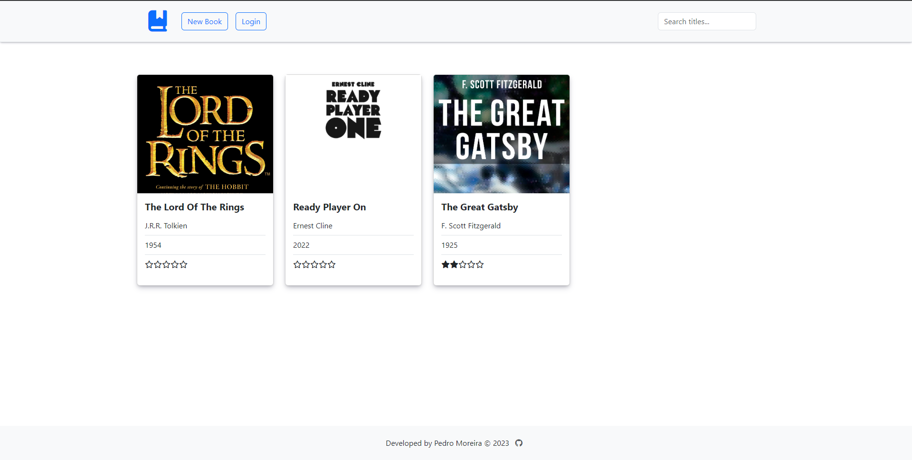
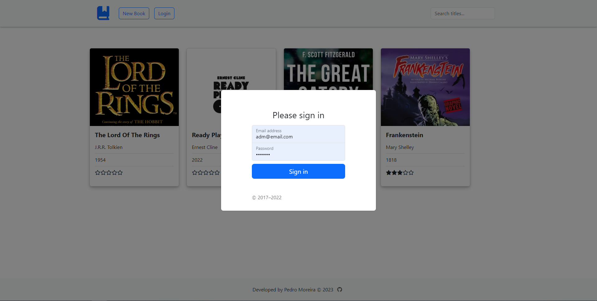

<!-- Improved compatibility of back to top link: See: https://github.com/othneildrew/Best-README-Template/pull/73 -->

<a name="readme-top"></a>

<!--
*** Thanks for checking out the Best-README-Template. If you have a suggestion
*** that would make this better, please fork the repo and create a pull request
*** or simply open an issue with the tag "enhancement".
*** Don't forget to give the project a star!
*** Thanks again! Now go create something AMAZING! :D
-->

<!-- PROJECT SHIELDS -->
<!--
*** I'm using markdown "reference style" links for readability.
*** Reference links are enclosed in brackets [ ] instead of parentheses ( ).
*** See the bottom of this document for the declaration of the reference variables
*** for contributors-url, forks-url, etc. This is an optional, concise syntax you may use.
*** https://www.markdownguide.org/basic-syntax/#reference-style-links
-->

[![Contributors][contributors-shield]](https://github.com/Pedro-Ribas-Moreira/odin-library/graphs/contributors)
[![Forks][forks-shield]](https://github.com/Pedro-Ribas-Moreira/odin-library/network/members)
[![Stargazers][stars-shield]](https://github.com/Pedro-Ribas-Moreira/odin-library/stargazers)
[![Issues][issues-shield]](https://github.com/Pedro-Ribas-Moreira/odin-library/issues)
[![LinkedIn][linkedin-shield]](https://www.linkedin.com/in/pedroh-moreira/)

<!-- [![MIT License][license-shield]][license-url] -->

<!-- PROJECT LOGO -->
<br />
<div align="center">
  <!-- <a href="https://github.com/Pedro-Ribas-Moreira/odin-library">
    
  </a> -->

<h1 align="center">Book Library</h1>

  <p align="center">
    A Book Library project, part of the <a target="_blank" href="https://www.theodinproject.com/lessons/node-path-javascript-library">The Odin Project - Fullstack Development Course </a> 
    <br />
    <!-- <a href="https://github.com/Pedro-Ribas-Moreira/odin-library"><strong>Explore the docs »</strong></a> -->
    <!-- <br /> -->
    <br />
    <a href="https://pedro-ribas-moreira.github.io/odin-library">View Demo</a>
    ·
    <a href="https://github.com/Pedro-Ribas-Moreira/odin-library/issues">Report Bug</a>
    ·
    <a href="https://github.com/Pedro-Ribas-Moreira/odin-library/issues">Request Feature</a>
  </p>
</div>

<!-- TABLE OF CONTENTS -->
<details>
  <summary>Table of Contents</summary>
  <ol>
    <li>
      <a href="#about-the-project">About The Project</a>
    </li>
    <li><a href="#built-with">Built With</a></li>
    <li>
      <a href="#getting-started">Getting Started</a>
      <!-- <ul> -->
        <!-- <li><a href="#prerequisites">Prerequisites</a></li> -->
        <!-- <li><a href="#installation">Installation</a></li> -->
      <!-- </ul> -->
    </li>
    <li><a href="#usage">Usage</a></li>
    <!-- <li><a href="#roadmap">Roadmap</a></li> -->
    <li><a href="#contributing">Contributing</a></li>
    <!-- <li><a href="#license">License</a></li> -->
    <li><a href="#contact">Contact</a></li>
    <!-- <li><a href="#acknowledgments">Acknowledgments</a></li> -->
  </ol>
</details>

<!-- ABOUT THE PROJECT -->

## About The Project

<!-- [![Product Name Screen Shot][product-screenshot]](https://example.com) -->
<p>This project consists of a CRUD application using javascript.
To achieve this purpose was decided to use local storage for persistent data and session storage to handle user login.
</p>


<!-- Here's a blank template to get started: To avoid retyping too much info. Do a search and replace with your text editor for the following: `Pedro-Ribas-Moreira`, `odin-foundations-rock-paper-scissors`, `twitter_handle`, `linkedin_username`, `email_client`, `email`, `Pokemon Dashboard`, `project_description` -->

<p align="right">(<a href="#readme-top">back to top</a>)</p>

## Built With

![javascript]
![css]
![html]<br>
![bootstrap.com]

<!-- - [![Next][next.js]][next-url]
- [![React][react.js]][react-url]
- [![Vue][vue.js]][vue-url]
- [![Angular][angular.io]][angular-url]
- [![Svelte][svelte.dev]][svelte-url]
- [![Laravel][laravel.com]][laravel-url]
- [![Bootstrap][bootstrap.com]][bootstrap-url]
- [![JQuery][jquery.com]][jquery-url] -->

<p align="right">(<a href="#readme-top">back to top</a>)</p>

<!-- GETTING STARTED -->

## Getting Started

<!-- This is an example of how you may give instructions on setting up your project locally. -->

To get a local copy up and running follow these simple example steps.

<!-- ### Prerequisites

This is an example of how to list things you need to use the software and how to install them.

- npm
  ```sh
  npm install npm@latest -g
  ``` -->

<!-- ### Installation -->

<!-- 1. Get a free API Key at [https://example.com](https://example.com) -->

1. Clone the repo
   ```sh
   git clone https://github.com/Pedro-Ribas-Moreira/odin-library
   ```
2. Run in localhost with a live server
   ```sh
   Go live
   ```

<br>To login as Adm use the following credentials:

```
email: adm@email.com
password: 1234567
```

<br>


<p align="right">(<a href="#readme-top">back to top</a>)</p>

<!-- USAGE EXAMPLES -->

<!-- _For more examples, please refer to the [Documentation](https://example.com)_ -->

<p align="right">(<a href="#readme-top">back to top</a>)</p>

<!-- ROADMAP -->

<!-- ## Roadmap

- [ ] Feature 1
- [ ] Feature 2
- [ ] Feature 3
  - [ ] Nested Feature

See the [open issues](https://github.com/Pedro-Ribas-Moreira/odin-library/issues) for a full list of proposed features (and known issues).

<p align="right">(<a href="#readme-top">back to top</a>)</p> -->

## Features

I created a login form as the user needs permission to delete and edit options.

Also, after implementing the Creating, Reading, Updating, and Deleting functions, I added an extra search function feature, where the user can search by book titles.

<br>

<!-- CONTRIBUTING -->

## Contributing

Contributions are what make the open source community such an amazing place to learn, inspire, and create. Any contributions you make are **greatly appreciated**.

If you have a suggestion that would make this better, please fork the repo and create a pull request. You can also simply open an issue with the tag "enhancement".
Don't forget to give the project a star! Thanks again!

1. Fork the Project
2. Create your Feature Branch (`git checkout -b feature/AmazingFeature`)
3. Commit your Changes (`git commit -m 'Add some AmazingFeature'`)
4. Push to the Branch (`git push origin feature/AmazingFeature`)
5. Open a Pull Request

<p align="right">(<a href="#readme-top">back to top</a>)</p>

<!-- LICENSE -->

<!-- ## License

Distributed under the MIT License. See `LICENSE.txt` for more information.

<p align="right">(<a href="#readme-top">back to top</a>)</p> -->

<!-- CONTACT -->

## Contact

Pedro Moreira - phribasmoreira@gmail.com

Project Link: [https://github.com/Pedro-Ribas-Moreira/odin-library](https://github.com/Pedro-Ribas-Moreira/odin-library)

[![linkedin-shield]](https://www.linkedin.com/in/pedroh-moreira/)

<p align="right">(<a href="#readme-top">back to top</a>)</p>

<!-- ACKNOWLEDGMENTS -->

<!-- ## Acknowledgments

- []()
- []()
- []()

<p align="right">(<a href="#readme-top">back to top</a>)</p> -->

<!-- MARKDOWN LINKS & IMAGES -->
<!-- https://www.markdownguide.org/basic-syntax/#reference-style-links -->

[contributors-shield]: https://img.shields.io/github/contributors/Pedro-Ribas-Moreira/odin-foundations-rock-paper-scissors.svg?style=for-the-badge
[contributors-url]: https://github.com/Pedro-Ribas-Moreira/odin-library/graphs/contributors
[forks-shield]: https://img.shields.io/github/forks/Pedro-Ribas-Moreira/odin-foundations-rock-paper-scissors.svg?style=for-the-badge
[forks-url]: https://github.com/Pedro-Ribas-Moreira/odin-library/network/members
[stars-shield]: https://img.shields.io/github/stars/Pedro-Ribas-Moreira/odin-foundations-rock-paper-scissors.svg?style=for-the-badge
[stars-url]: https://github.com/Pedro-Ribas-Moreira/odin-library/stargazers
[issues-shield]: https://img.shields.io/github/issues/Pedro-Ribas-Moreira/odin-foundations-rock-paper-scissors.svg?style=for-the-badge
[issues-url]: https://github.com/Pedro-Ribas-Moreira/odin-library/issues
[license-shield]: https://img.shields.io/github/license/Pedro-Ribas-Moreira/odin-foundations-rock-paper-scissors.svg?style=for-the-badge
[license-url]: https://github.com/Pedro-Ribas-Moreira/odin-library/blob/master/LICENSE.txt
[linkedin-shield]: https://img.shields.io/badge/-LinkedIn-black.svg?style=for-the-badge&logo=linkedin&colorB=555
[linkedin-url]: https://www.linkedin.com/in/pedroh-moreira/
[product-screenshot]: images/screenshot.png
[next.js]: https://img.shields.io/badge/next.js-000000?style=for-the-badge&logo=nextdotjs&logoColor=white
[next-url]: https://nextjs.org/
[react.js]: https://img.shields.io/badge/React-20232A?style=for-the-badge&logo=react&logoColor=61DAFB
[react-url]: https://reactjs.org/
[vue.js]: https://img.shields.io/badge/Vue.js-35495E?style=for-the-badge&logo=vuedotjs&logoColor=4FC08D
[vue-url]: https://vuejs.org/
[angular.io]: https://img.shields.io/badge/Angular-DD0031?style=for-the-badge&logo=angular&logoColor=white
[angular-url]: https://angular.io/
[svelte.dev]: https://img.shields.io/badge/Svelte-4A4A55?style=for-the-badge&logo=svelte&logoColor=FF3E00
[svelte-url]: https://svelte.dev/
[laravel.com]: https://img.shields.io/badge/Laravel-FF2D20?style=for-the-badge&logo=laravel&logoColor=white
[laravel-url]: https://laravel.com
[bootstrap.com]: https://img.shields.io/badge/Bootstrap-563D7C?style=for-the-badge&logo=bootstrap&logoColor=white
[bootstrap]: https://getbootstrap.com
[jquery.com]: https://img.shields.io/badge/jQuery-0769AD?style=for-the-badge&logo=jquery&logoColor=white
[jquery-url]: https://jquery.com
[javascript]: https://img.shields.io/badge/-Javascript-yellow
[css]: https://img.shields.io/badge/-CSS-blue
[html]: https://img.shields.io/badge/-HTML-red
[sass]: https://img.shields.io/badge/-SASS-FF69B4
[chartjs]: https://img.shields.io/badge/-Chart.Js-yellowgreen
[apis]: https://img.shields.io/badge/-APIs-informational
